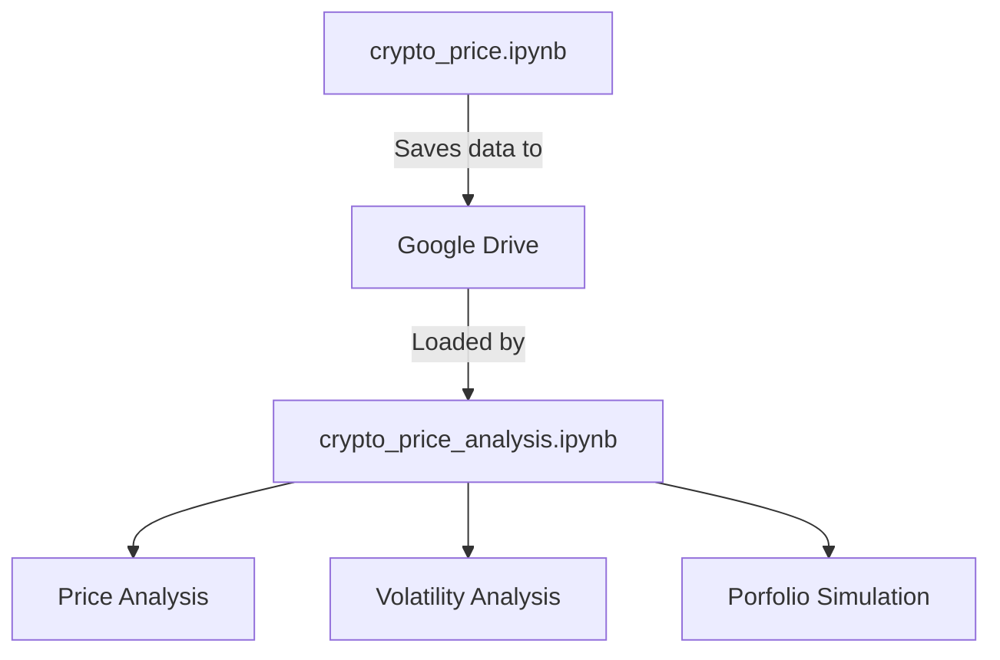

# Cryptocurrency Price Comparison Analysis
[](https://bitcoin.org/en/)
[](https://ethereum.org/en/)
[](https://ripple.com/xrp/)
[](https://cardano.org/)
[](https://www.shibatoken.com/)

[](https://finance.yahoo.com/markets/crypto/all/)
[](https://python.org)
[](LICENSE)

## Project Description
A comprehensive 5-year historical analysis tool for major cryptocurrencies, fetching complete OHLCV (Open-High-Low-Close-Volume) data directly from Yahoo Finance.

## Data Collection Methodology

This project systematically collects and processes cryptocurrency data using Yahoo Finance's API through the following workflow:

```python
# Configure cryptocurrency tickers and date range
crypto_tickers = {
    'BTC': 'BTC-USD',  # Bitcoin
    'ETH': 'ETH-USD',  # Ethereum
    'SHIB': 'SHIB-USD', # Shiba Inu
    'ADA': 'ADA-USD',  # Cardano
    'XRP': 'XRP-USD'   # Ripple
}

# Set 5-year historical window
end_date = datetime.now()
start_date = end_date - timedelta(days=5*365)

```
## Table of Contents
- [Features](#features)
- [Data Sources](#data-sources)
- [Installation & Setup]()
- [Analysis Findings]()

## Features

- Real-time price comparison between BTC, ETH, XRP, ADA, and SHIB
- Historical price analysis (5Y)
- Volatility metrics and correlation coefficients
- Relative performance comparison
- Trading volume and market cap analysis
- Yahoo Finance API integration

## Data Sources

This project exclusively uses **[Yahoo Finance](https://finance.yahoo.com/cryptocurrencies/)** for:
- Real-time price data
- Historical OHLC (Open-High-Low-Close) values
- Trading volume metrics
- Market capitalization data

```python
# Example Yahoo Finance API call
import yfinance as yf

btc = yf.Ticker("BTC-USD")
btc_history = btc.history(period="1y")
```
Here's an expanded **Installation & Setup** section that clearly documents your two-notebook workflow (Data Collection + Analysis) in Google Colab:

---

## Installation & Setup

This project uses a two-notebook workflow in **Google Colab**:

### 1. Data Collection Notebook (`crypto_price.ipynb`)
[](https://github.com/LexMainye/Crypto-Price-Analysis/blob/main/Crypto_Price_Data.ipynb)

**Purpose**: Fetches 5 years of historical OHLCV data from Yahoo Finance and saves it to Google Drive.

#### Setup Instructions:
```python
# Run these commands first in Colab
!pip install yfinance pandas --quiet
!mkdir -p /content/crypto_data

# Mount Google Drive (for saving datasets)
from google.colab import drive
drive.mount('/content/drive')

# Set your custom data path
data_path = "/content/drive/MyDrive/CryptoProject/data/"
```

#### Key Cells:
1. **Ticker Configuration**:
```python
crypto_tickers = {
    'BTC': 'BTC-USD',
    'ETH': 'ETH-USD', 
    'SHIB': 'SHIB-USD',
    'ADA': 'ADA-USD',
    'XRP': 'XRP-USD'
}
```

2. **Data Fetching Execution**:
```python
# Calculate date range for 5 years
end_date = datetime.now()
start_date = end_date - timedelta(days=5*365)

# Format dates as strings for yfinance
start_date_str = start_date.strftime('%Y-%m-%d')
end_date_str = end_date.strftime('%Y-%m-%d')

def get_crypto_data(tickers_dict, start_date, end_date):
    results = {}
    print("\nFetching 5-year historical cryptocurrency data from Yahoo Finance...")

    for crypto_name, ticker in tickers_dict.items():
        print(f"\nFetching data for {crypto_name} ({ticker})...")
        try:
            # Get complete OHLCV data
            data = yf.download(
                ticker,
                start=start_date,
                end=end_date,
                progress=False
            )

            if not data.empty:
                results[crypto_name] = data
                print(f"Successfully fetched {len(data)} days of data for {crypto_name}")
            else:
                print(f"No data returned for {crypto_name}")

        except Exception as e:
            print(f"Error fetching data for {crypto_name}: {str(e)}")

    return results

# Fetch all cryptocurrency data
historical_data = get_crypto_data(crypto_tickers, start_date_str, end_date_str)

# Save each cryptocurrency's data separately
print("\nSaving data for each cryptocurrency:")
for crypto_name, data in historical_data.items():
    if not data.empty:
        # Create filename (e.g. btc_5year_daily_data.csv)
        filename = f"{crypto_name.lower()}_5year_daily_data.csv"
        filepath = os.path.join(data_path, filename)

        # Save complete OHLCV data
        data.to_csv(filepath)
        print(f"Saved {crypto_name} data to {filename}")

        # Save monthly resampled data
        monthly_data = data.resample('M').last()
        monthly_filename = f"{crypto_name.lower()}_5year_monthly_data.csv"
        monthly_filepath = os.path.join(data_path, monthly_filename)
        monthly_data.to_csv(monthly_filepath)
        print(f"Saved {crypto_name} monthly data to {monthly_filename}")

# Save combined close prices
if historical_data:
    combined_close = pd.DataFrame()
    for crypto_name, data in historical_data.items():
        if not data.empty:
            combined_close[crypto_name] = data['Close']

    combined_filename = "all_cryptos_5year_close_prices.csv"
    combined_filepath = os.path.join(data_path, combined_filename)
    combined_close.to_csv(combined_filepath)
    print(f"\nSaved combined close prices to {combined_filename}")
```

3. **Data Saving** (to Google Drive):
```python
# Example save path in Drive
data_path = "/content/drive/MyDrive/CryptoProject/data/"
```

---

### 2. Analysis Notebook (`crypto_price_analysis.ipynb`)
[](https://github.com/LexMainye/Crypto-Price-Analysis/blob/main/Crypto_Price_Analysis.ipynb)

**Purpose**: Performs statistical analysis and visualizations on the collected data.

#### Setup Instructions:
```python
# Mount Google Drive (same as Notebook 1)
from google.colab import drive
drive.mount('/content/drive')

# Install analysis dependencies
!pip install matplotlib seaborn numpy --quiet

# Set path to collected data
data_path = "/content/drive/MyDrive/CryptoProject/data/"
```

#### Key Analysis Features:
1. **Data Loading**:
```python
def load_crypto_data(crypto_name):
    filepath = f"{data_path}{crypto_name.lower()}_5year_daily_data.csv"
    return pd.read_csv(filepath, parse_dates=['Date'], index_col='Date')
```

2. **Sample Analysis Cells**:
```python
# Comparative Returns Analysis
btc = load_crypto_data('BTC')
eth = load_crypto_data('ETH')

# Calculate annualized returns
btc_returns = btc['Close'].pct_change().mean() * 365
eth_returns = eth['Close'].pct_change().mean() * 365
```

3. **Visualization Examples**:
```python
import matplotlib.pyplot as plt

plt.figure(figsize=(12,6))
plt.plot(btc['Close'], label='Bitcoin')
plt.plot(eth['Close'], label='Ethereum')
plt.title('5-Year Price Comparison')
plt.legend()
plt.show()
```

---

### Workflow Diagram


### Recommended Colab Settings
1. **Runtime Type**: GPU/TPU not required (CPU is sufficient)
2. **Recommended Colab RAM**: 8GB+ (for handling 5 years of multi-asset data)
3. **Authentication**: Only needed for Google Drive access

### First-Time Setup Checklist
1. Run `crypto_price.ipynb` first to populate your Drive with data
2. Verify files exist in your Drive folder:
   - `btc_5year_daily_data.csv`
   - `eth_5year_daily_data.csv` 
   - ... (other assets)
   - `all_cryptos_5year_close_prices.csv`
3. Open `crypto_price_analysis.ipynb` and update the `data_path` if needed

---
# Analysis Findings


# Background Information about the Crypto currencies Being Analysed

**Bitcoin: **

Bitcoin (abbreviation: BTC; sign: ₿) is the first decentralized cryptocurrency. Based on a free-market ideology, bitcoin was invented in 2008 by an unknown entity under the pseudonym of Satoshi Nakamoto. Use of bitcoin as a currency began in 2009, with the release of its open-source implementation.: ch. 1  In 2021, El Salvador adopted it as legal tender. It is mostly seen as an investment and has been described by some scholars as an economic bubble. As bitcoin is pseudonymous, its use by criminals has attracted the attention of regulators, leading to its ban by several countries as of 2021.

Bitcoin works through the collaboration of computers, each of which acts as a node in the peer-to-peer bitcoin network. Each node maintains an independent copy of a public distributed ledger of transactions, called a blockchain, without central oversight. 

Transactions are validated through the use of cryptography, making it practically impossible for one person to spend another person's bitcoin, as long as the owner of the bitcoin keeps certain sensitive data secret. 

Consensus between nodes about the content of the blockchain is achieved using a computationally intensive process based on proof of work, called mining, which is typically performed by purpose-built computers called miners. These miners don't directly act as nodes, but do communicate with nodes.

The mining process is primarily intended to prevent double-spending and get all nodes to agree on the content of the blockchain, but it also has desirable side-effects such as making it infeasible for adversaries to stifle valid transactions or alter the historical record of transactions, since doing so generally requires the adversary to have access to more mining power than the rest of the network combined. It is also used to regulate the rate at which new bitcoin is issued and enters circulation. Mining consumes large quantities of electricity and has been criticized for its environmental impact.

--------------------------------------------------------------------------------

**Ethereum: **

Ethereum is a decentralized blockchain with smart contract functionality. Ether (abbreviation: ETH) is the native cryptocurrency of the platform. Among cryptocurrencies, ether is second only to bitcoin in market capitalization. It is open-source software.

Ethereum was conceived in 2013 by programmer Vitalik Buterin. Other founders include Gavin Wood, Charles Hoskinson, Anthony Di Iorio, and Joseph Lubin. In 2014, development work began and was crowdfunded, and the network went live on 30 July 2015. Ethereum allows anyone to deploy decentralized applications onto it, with which users can interact. Decentralized finance (DeFi) applications provide financial instruments that do not directly rely on financial intermediaries like brokerages, exchanges, or banks. This facilitates borrowing against cryptocurrency holdings or lending them out for interest. 

Ethereum also allows users to create and exchange non-fungible tokens (NFTs), which are tokens that can be tied to unique digital assets, such as images. Additionally, many other cryptocurrencies utilize the ERC-20 token standard on top of the Ethereum blockchain and have utilized the platform for initial coin offerings.

On 15 September 2022, Ethereum transitioned its consensus mechanism from proof-of-work (PoW) to proof-of-stake (PoS) in an update known as "The Merge", which cut the blockchain's energy usage by 99%.

--------------------------------------------------------------------------------

**Cardano:**

Cardano is a public blockchain platform which uses the cryptocurrency ADA to facilitate transactions.
Cardano's development began in 2015, led by Ethereum co-founder Charles Hoskinson. The project is overseen and supervised by the Cardano Foundation based in Zug, Switzerland. When launched in 2017, it was the largest cryptocurrency to use a proof of stake consensus mechanism, which is seen as more environmentally friendly than proof-of-work protocols.

--------------------------------------------------------------------------------

**Shiba Inu:**

Shiba Inu token (ticker: SHIB) is a decentralized cryptocurrency created in August 2020 by an anonymous person or group using the pseudonym "Ryoshi". It is inspired by the Shiba Inu (柴犬), a Japanese dog breed, which also serves as the mascot for Dogecoin, another cryptocurrency with meme origins. Some categorize Shiba Inu as a "meme coin." Concerns have been expressed about the concentration of the coin with a single "whale" wallet controlling billions of dollars' worth of the token, and frenzied buying by retail investors motivated by fear of missing out (FOMO). Shiba Inu was introduced with a branding that positioned it as a potential 'Dogecoin competitor'.

On 13 May 2021, Vitalik Buterin donated more than 50 trillion SHIB (worth over $1 billion at the time) to the India COVID-Crypto Relief Fund. Also in May 2021, Buterin donated SHIB worth $665 million to the Future of Life Institute, which focuses on regulating artificial intelligence to protect from existential risk from advanced artificial intelligence.

In October 2021, the market price of the cryptocurrency experienced a significant rise, reportedly increasing by 240% within a week. However, at the beginning of November, it faced a decline, reportedly losing approximately 55% of its value by the end of the month.

--------------------------------------------------------------------------------

**Ripple:**

The XRP Ledger (XRPL), also called the Ripple Protocol, is a cryptocurrency platform launched in 2012 by Ripple Labs. The XRPL employs the native cryptocurrency known as XRP, and supports tokens, cryptocurrency or other units of value such as frequent flyer miles or mobile minutes....

--------------------------------------------------------------------------------
