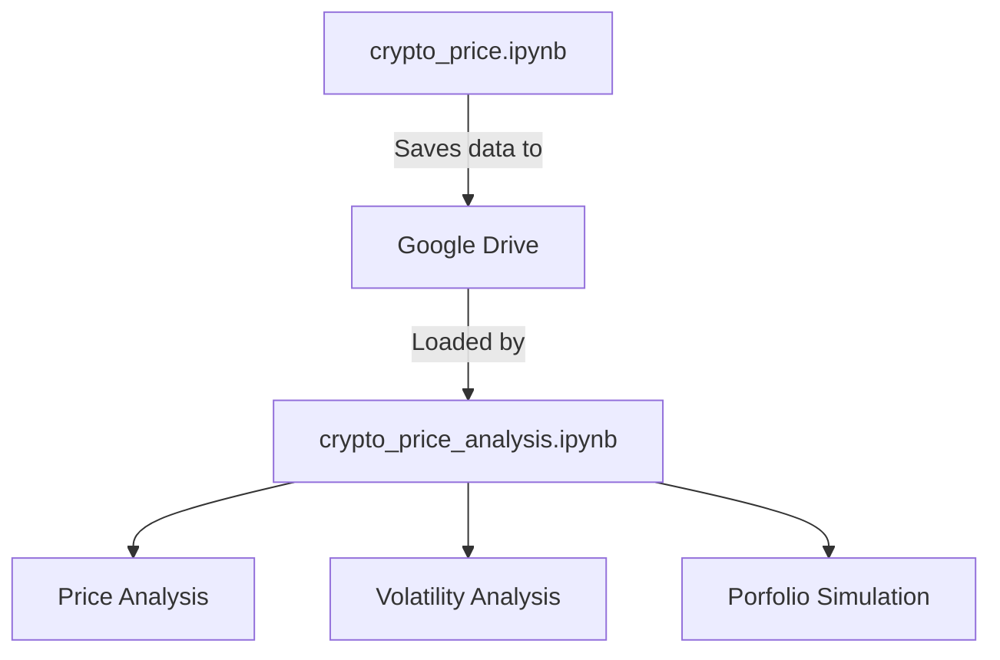

# Cryptocurrency Price Comparison Analysis
[](https://bitcoin.org/en/)
[](https://ethereum.org/en/)
[](https://ripple.com/xrp/)
[](https://cardano.org/)
[](https://www.shibatoken.com/)

[](https://finance.yahoo.com/markets/crypto/all/)
[](https://python.org)
[](LICENSE)

## Project Description
A comprehensive 5-year historical analysis tool for major cryptocurrencies, fetching complete OHLCV (Open-High-Low-Close-Volume) data directly from Yahoo Finance.

## Data Collection Methodology

This project systematically collects and processes cryptocurrency data using Yahoo Finance's API through the following workflow:

```python
# Configure cryptocurrency tickers and date range
crypto_tickers = {
    'BTC': 'BTC-USD',  # Bitcoin
    'ETH': 'ETH-USD',  # Ethereum
    'SHIB': 'SHIB-USD', # Shiba Inu
    'ADA': 'ADA-USD',  # Cardano
    'XRP': 'XRP-USD'   # Ripple
}

# Set 5-year historical window
end_date = datetime.now()
start_date = end_date - timedelta(days=5*365)

```
## Table of Contents
- [Features](#features)
- [Data Sources](#data-sources)
- [Installation & Setup]()
- [Analysis Findings]()

## Features

- Real-time price comparison between BTC, ETH, XRP, ADA, and SHIB
- Historical price analysis (5Y)
- Volatility metrics and correlation coefficients
- Relative performance comparison
- Trading volume and market cap analysis
- Yahoo Finance API integration

## Data Sources

This project exclusively uses **[Yahoo Finance](https://finance.yahoo.com/cryptocurrencies/)** for:
- Real-time price data
- Historical OHLC (Open-High-Low-Close) values
- Trading volume metrics
- Market capitalization data

```python
# Example Yahoo Finance API call
import yfinance as yf

btc = yf.Ticker("BTC-USD")
btc_history = btc.history(period="1y")
```
Here's an expanded **Installation & Setup** section that clearly documents your two-notebook workflow (Data Collection + Analysis) in Google Colab:

---

## Installation & Setup

This project uses a two-notebook workflow in **Google Colab**:

### 1. Data Collection Notebook (`crypto_price.ipynb`)
[](https://github.com/LexMainye/Crypto-Price-Analysis/blob/main/Crypto_Price_Data.ipynb)

**Purpose**: Fetches 5 years of historical OHLCV data from Yahoo Finance and saves it to Google Drive.

#### Setup Instructions:
```python
# Run these commands first in Colab
!pip install yfinance pandas --quiet
!mkdir -p /content/crypto_data

# Mount Google Drive (for saving datasets)
from google.colab import drive
drive.mount('/content/drive')

# Set your custom data path
data_path = "/content/drive/MyDrive/CryptoProject/data/"
```

#### Key Cells:
1. **Ticker Configuration**:
```python
crypto_tickers = {
    'BTC': 'BTC-USD',
    'ETH': 'ETH-USD', 
    'SHIB': 'SHIB-USD',
    'ADA': 'ADA-USD',
    'XRP': 'XRP-USD'
}
```

2. **Data Fetching Execution**:
```python
# Calculate date range for 5 years
end_date = datetime.now()
start_date = end_date - timedelta(days=5*365)

# Format dates as strings for yfinance
start_date_str = start_date.strftime('%Y-%m-%d')
end_date_str = end_date.strftime('%Y-%m-%d')

def get_crypto_data(tickers_dict, start_date, end_date):
    results = {}
    print("\nFetching 5-year historical cryptocurrency data from Yahoo Finance...")

    for crypto_name, ticker in tickers_dict.items():
        print(f"\nFetching data for {crypto_name} ({ticker})...")
        try:
            # Get complete OHLCV data
            data = yf.download(
                ticker,
                start=start_date,
                end=end_date,
                progress=False
            )

            if not data.empty:
                results[crypto_name] = data
                print(f"Successfully fetched {len(data)} days of data for {crypto_name}")
            else:
                print(f"No data returned for {crypto_name}")

        except Exception as e:
            print(f"Error fetching data for {crypto_name}: {str(e)}")

    return results

# Fetch all cryptocurrency data
historical_data = get_crypto_data(crypto_tickers, start_date_str, end_date_str)

# Save each cryptocurrency's data separately
print("\nSaving data for each cryptocurrency:")
for crypto_name, data in historical_data.items():
    if not data.empty:
        # Create filename (e.g. btc_5year_daily_data.csv)
        filename = f"{crypto_name.lower()}_5year_daily_data.csv"
        filepath = os.path.join(data_path, filename)

        # Save complete OHLCV data
        data.to_csv(filepath)
        print(f"Saved {crypto_name} data to {filename}")

        # Save monthly resampled data
        monthly_data = data.resample('M').last()
        monthly_filename = f"{crypto_name.lower()}_5year_monthly_data.csv"
        monthly_filepath = os.path.join(data_path, monthly_filename)
        monthly_data.to_csv(monthly_filepath)
        print(f"Saved {crypto_name} monthly data to {monthly_filename}")

# Save combined close prices
if historical_data:
    combined_close = pd.DataFrame()
    for crypto_name, data in historical_data.items():
        if not data.empty:
            combined_close[crypto_name] = data['Close']

    combined_filename = "all_cryptos_5year_close_prices.csv"
    combined_filepath = os.path.join(data_path, combined_filename)
    combined_close.to_csv(combined_filepath)
    print(f"\nSaved combined close prices to {combined_filename}")
```

3. **Data Saving** (to Google Drive):
```python
# Example save path in Drive
data_path = "/content/drive/MyDrive/CryptoProject/data/"
```

---

### 2. Analysis Notebook (`crypto_price_analysis.ipynb`)
[](https://github.com/LexMainye/Crypto-Price-Analysis/blob/main/Crypto_Price_Analysis.ipynb)

**Purpose**: Performs statistical analysis and visualizations on the collected data.

#### Setup Instructions:
```python
# Mount Google Drive (same as Notebook 1)
from google.colab import drive
drive.mount('/content/drive')

# Install analysis dependencies
!pip install matplotlib seaborn numpy --quiet

# Set path to collected data
data_path = "/content/drive/MyDrive/CryptoProject/data/"
```

#### Key Analysis Features:
1. **Data Loading**:
```python
def load_crypto_data(crypto_name):
    filepath = f"{data_path}{crypto_name.lower()}_5year_daily_data.csv"
    return pd.read_csv(filepath, parse_dates=['Date'], index_col='Date')
```

2. **Sample Analysis Cells**:
```python
# Comparative Returns Analysis
btc = load_crypto_data('BTC')
eth = load_crypto_data('ETH')

# Calculate annualized returns
btc_returns = btc['Close'].pct_change().mean() * 365
eth_returns = eth['Close'].pct_change().mean() * 365
```

3. **Visualization Examples**:
```python
import matplotlib.pyplot as plt

plt.figure(figsize=(12,6))
plt.plot(btc['Close'], label='Bitcoin')
plt.plot(eth['Close'], label='Ethereum')
plt.title('5-Year Price Comparison')
plt.legend()
plt.show()
```

---


### Workflow Diagram



### Recommended Colab Settings
1. **Runtime Type**: GPU/TPU not required (CPU is sufficient)
2. **Recommended Colab RAM**: 8GB+ (for handling 5 years of multi-asset data)
3. **Authentication**: Only needed for Google Drive access

### First-Time Setup Checklist
1. Run `crypto_price.ipynb` first to populate your Drive with data
2. Verify files exist in your Drive folder:
   - `btc_5year_daily_data.csv`
   - `eth_5year_daily_data.csv` 
   - ... (other assets)
   - `all_cryptos_5year_close_prices.csv`
3. Open `crypto_price_analysis.ipynb` and update the `data_path` if needed

---
# Analysis Findings


# Background Information about the Crypto currencies Being Analysed

**Bitcoin: **

Bitcoin (abbreviation: BTC; sign: ₿) is the first decentralized cryptocurrency. Based on a free-market ideology, bitcoin was invented in 2008 by an unknown entity under the pseudonym of Satoshi Nakamoto. Use of bitcoin as a currency began in 2009, with the release of its open-source implementation.: ch. 1  In 2021, El Salvador adopted it as legal tender. It is mostly seen as an investment and has been described by some scholars as an economic bubble. As bitcoin is pseudonymous, its use by criminals has attracted the attention of regulators, leading to its ban by several countries as of 2021.

Bitcoin works through the collaboration of computers, each of which acts as a node in the peer-to-peer bitcoin network. Each node maintains an independent copy of a public distributed ledger of transactions, called a blockchain, without central oversight. 

Transactions are validated through the use of cryptography, making it practically impossible for one person to spend another person's bitcoin, as long as the owner of the bitcoin keeps certain sensitive data secret. 

Consensus between nodes about the content of the blockchain is achieved using a computationally intensive process based on proof of work, called mining, which is typically performed by purpose-built computers called miners. These miners don't directly act as nodes, but do communicate with nodes.

The mining process is primarily intended to prevent double-spending and get all nodes to agree on the content of the blockchain, but it also has desirable side-effects such as making it infeasible for adversaries to stifle valid transactions or alter the historical record of transactions, since doing so generally requires the adversary to have access to more mining power than the rest of the network combined. It is also used to regulate the rate at which new bitcoin is issued and enters circulation. Mining consumes large quantities of electricity and has been criticized for its environmental impact.

--------------------------------------------------------------------------------

**Ethereum: **

Ethereum is a decentralized blockchain with smart contract functionality. Ether (abbreviation: ETH) is the native cryptocurrency of the platform. Among cryptocurrencies, ether is second only to bitcoin in market capitalization. It is open-source software.

Ethereum was conceived in 2013 by programmer Vitalik Buterin. Other founders include Gavin Wood, Charles Hoskinson, Anthony Di Iorio, and Joseph Lubin. In 2014, development work began and was crowdfunded, and the network went live on 30 July 2015. Ethereum allows anyone to deploy decentralized applications onto it, with which users can interact. Decentralized finance (DeFi) applications provide financial instruments that do not directly rely on financial intermediaries like brokerages, exchanges, or banks. This facilitates borrowing against cryptocurrency holdings or lending them out for interest. 

Ethereum also allows users to create and exchange non-fungible tokens (NFTs), which are tokens that can be tied to unique digital assets, such as images. Additionally, many other cryptocurrencies utilize the ERC-20 token standard on top of the Ethereum blockchain and have utilized the platform for initial coin offerings.

On 15 September 2022, Ethereum transitioned its consensus mechanism from proof-of-work (PoW) to proof-of-stake (PoS) in an update known as "The Merge", which cut the blockchain's energy usage by 99%.

--------------------------------------------------------------------------------

**Cardano:**

Cardano is a public blockchain platform which uses the cryptocurrency ADA to facilitate transactions.
Cardano's development began in 2015, led by Ethereum co-founder Charles Hoskinson. The project is overseen and supervised by the Cardano Foundation based in Zug, Switzerland. When launched in 2017, it was the largest cryptocurrency to use a proof of stake consensus mechanism, which is seen as more environmentally friendly than proof-of-work protocols.

--------------------------------------------------------------------------------

**Shiba Inu:**

Shiba Inu token (ticker: SHIB) is a decentralized cryptocurrency created in August 2020 by an anonymous person or group using the pseudonym "Ryoshi". It is inspired by the Shiba Inu (柴犬), a Japanese dog breed, which also serves as the mascot for Dogecoin, another cryptocurrency with meme origins. Some categorize Shiba Inu as a "meme coin." Concerns have been expressed about the concentration of the coin with a single "whale" wallet controlling billions of dollars' worth of the token, and frenzied buying by retail investors motivated by fear of missing out (FOMO). Shiba Inu was introduced with a branding that positioned it as a potential 'Dogecoin competitor'.

On 13 May 2021, Vitalik Buterin donated more than 50 trillion SHIB (worth over $1 billion at the time) to the India COVID-Crypto Relief Fund. Also in May 2021, Buterin donated SHIB worth $665 million to the Future of Life Institute, which focuses on regulating artificial intelligence to protect from existential risk from advanced artificial intelligence.

In October 2021, the market price of the cryptocurrency experienced a significant rise, reportedly increasing by 240% within a week. However, at the beginning of November, it faced a decline, reportedly losing approximately 55% of its value by the end of the month.

--------------------------------------------------------------------------------

**Ripple:**

The XRP Ledger (XRPL), also called the Ripple Protocol, is a cryptocurrency platform launched in 2012 by Ripple Labs. The XRPL employs the native cryptocurrency known as XRP, and supports tokens, cryptocurrency or other units of value such as frequent flyer miles or mobile minutes....

--------------------------------------------------------------------------------


# **Price Action**

 
 


**General Observations Across All Cryptocurrencies**
---

1. **Time Period**: The data spans from 2020 to 2025, covering a significant period in the crypto market, including the 2021 bull run, the 2022 bear market, and a potential recovery or new bull run in 2024-2025.

2. **Market Cycles**:
   - **2021 Bull Run🐂**: All cryptocurrencies show a significant price spike in early 2021, reflecting the broader crypto market bull run driven by institutional adoption, retail FOMO (fear of missing out), and macroeconomic factors like low interest rates.

   - **2022 Bear Market🧸**: A sharp decline follows in 2022, likely due to macroeconomic tightening (e.g., rising interest rates), regulatory concerns, and high-profile crypto failures (e.g., Terra-Luna collapse, FTX bankruptcy).

   - **2023 Consolidation 🔄**: Most cryptocurrencies show a period of consolidation or sideways movement in 2023, indicating a lack of strong directional momentum.

   - **2024-2025 Surge 📈**: A strong upward trend emerges in 2024-2025 for most cryptocurrencies, suggesting a new bull market, possibly driven by positive developments like regulatory clarity, Bitcoin ETF approvals, or renewed retail and institutional interest.

3. **Volatility**:
   - The High and Low lines show significant daily price ranges, especially during periods of rapid price movement (e.g., early 2021 and 2024-2025), indicating high volatility.

   - SHIB exhibits the most extreme volatility, with massive spikes and drops, typical of meme coins with smaller market caps and speculative trading.

---
**Individual Analysis of Each Cryptocurrency**

**1. Bitcoin (BTC) Price Action**

- **2020-2021**: BTC starts at around USD 10,000  and surges to nearly USD 65,000 by mid-2021 a classic bull run pattern. The High and Low lines show increased volatility during this period.

- **2022**: A sharp decline brings BTC down to around USD 20,000, reflecting the bear market. Volatility decreases as the price consolidates.

- **2023**: BTC trades sideways between USD 20,000 and USD 30,000, with relatively low volatility.

- **2024-2025**: A massive rally takes BTC to over USD 100,000 by early 2025, with a slight pullback toward the end. This surge aligns with historical Bitcoin halving cycles (the 2024 halving likely contributed to this rally) and potential ETF approvals or institutional adoption.

**2. Ethereum (ETH) Price Action**

- **2020-2021**: ETH rises from around USD 400 to nearly USD 4,800 by mid-2021, following Bitcoin’s lead but with a slightly higher percentage gain, likely due to the growth of DeFi and NFT ecosystems on Ethereum.

- **2022**: ETH drops to around USD 1,000, mirroring the broader market downturn. The Ethereum Merge (transition to Proof of Stake in September 2022) may have introduced some volatility but didn’t prevent the bear market impact.

- **2023**: ETH consolidates between USD 1,000 and USD 2,000, with moderate volatility.

- **2024-2025**: ETH surges to over USD 5,000, with a pullback to around USD 4,000 by early 2025. This rally could be driven by increased adoption of Ethereum-based applications, layer-2 scaling solutions (e.g., Arbitrum, Optimism), and the broader market recovery.

**3. Cardano (ADA) Price Action**

- **2020-2021**: ADA starts at around USD 0.03 and spikes to over USD 3 by mid-2021, a massive gain driven by hype around Cardano’s smart contract rollout (Alonzo hard fork in September 2021).

- **2022-2023**: ADA drops sharply to around $0.3 and consolidates between USD 0.3 and USD 0.5, with low volatility. This period reflects a lack of significant catalysts for Cardano and the broader bear market.

- **2024-2025**: ADA sees a modest rally to around USD 1 by early 2025, but it doesn’t match the explosive growth of BTC or ETH. This suggests Cardano may have underperformed relative to larger cryptocurrencies, possibly due to slower ecosystem growth or competition from other layer-1 blockchains like Solana.

**4. Shiba Inu (SHIB) Price Action**
- **2020-2021**: SHIB starts near USD 0 and spikes dramatically to around USD 0.00008 in late 2021, a classic meme coin pump driven by retail speculation, social media hype, and the broader altcoin season.

- **2022-2023**: SHIB crashes to around USD 0.00001 and trades sideways with occasional smaller spikes (e.g., in 2024). This reflects the speculative nature of meme coins, which often lack fundamental value and are highly sensitive to market sentiment.

- **2024-2025**: SHIB sees another spike to around USD 0.00003, but it remains far below its 2021 peak. This suggests meme coins can still experience pumps during bull markets, but their long-term sustainability is questionable.

**5. Ripple (XRP) Price Action**
- **2020-2021**: XRP starts at around USD 0.2 and spikes to USD 1.8 in early 2021, benefiting from the bull market despite ongoing legal challenges (SEC lawsuit filed in December 2020).

- **2022-2023**: XRP drops to around USD 0.3 and consolidates, with low volatility. The SEC lawsuit likely suppressed XRP’s price, as many exchanges delisted it, reducing liquidity and investor confidence.

- **2024-2025**: XRP experiences a dramatic rally to over USD 3.5 by early 2025, with a pullback to USD 3. This surge likely reflects a resolution of the SEC lawsuit (possibly in 2023 or 2024), renewed exchange listings, and increased adoption of Ripple’s payment solutions by financial institutions.

---

 **Comparative Insights**

1. **Correlation with Bitcoin**:
   - All cryptocurrencies show a strong correlation with Bitcoin’s price movements. When BTC surges (e.g., 2021 and 2024-2025), ETH, ADA, SHIB, and XRP also rise, though with varying magnitudes.
   - During the 2022 bear market, all cryptocurrencies decline, reinforcing Bitcoin’s role as a market leader.

2. **Relative Performance**:
   - **BTC and ETH**: As the largest cryptocurrencies by market cap, they show the most consistent long-term growth, with BTC reaching USD 100,000 and ETH surpassing USD 5,000 by 2025. Their rallies are likely driven by institutional adoption, Bitcoin halving cycles, and Ethereum’s ecosystem growth.

   - **XRP**: XRP’s 2024-2025 surge is the most dramatic in percentage terms (from USD 0.3 to USD 3.5, a 10x increase), likely due to a specific catalyst (e.g., SEC lawsuit resolution). However, its price remains lower than ETH’s in absolute terms.

   - **ADA**: Cardano underperforms relative to BTC, ETH, and XRP, with a more modest rally to USD 1. This suggests Cardano may have lost momentum compared to competitors.

   - **SHIB**: Shiba Inu shows the most extreme volatility, with massive spikes and crashes. Its price remains very low (in the USD 0.00001- USD 0.00003 range), reflecting its speculative nature and lack of fundamental value compared to the others.

3. **Volatility Patterns**:
   - SHIB exhibits the highest volatility, with extreme spikes in 2021 and 2024, typical of meme coins.
   - BTC and ETH show moderate volatility, with larger daily ranges during bull runs (2021, 2024-2025) but more stability during consolidation (2023).
   - XRP and ADA show lower volatility during 2022-2023, likely due to regulatory uncertainty (XRP) and lack of catalysts (ADA).

4. **2024-2025 Bull Run**:
   - The 2024-2025 period is a clear bull market for all cryptocurrencies, but the magnitude varies:
     - BTC: +400% (from USD 20,000 to USD 100,000)
     - ETH: +400% (from USD 1,000 to USD 5,000)
     - XRP: +1000% (from USD 0.3 to USD 3.5)
     - ADA: +200% (from USD 0.3 to USD 1)
     - SHIB: +200% (from USD 0.00001 to USD 0.00003)
   - XRP’s outsized gain suggests a unique catalyst, while BTC and ETH benefit from broader market trends. ADA and SHIB lag in relative terms, indicating weaker fundamentals or market interest.

5. **Regulatory Impact**:
   - XRP’s price action is heavily influenced by the SEC lawsuit. The 2022-2023 consolidation and 2024-2025 surge align with the timeline of legal developments (e.g., a favorable ruling or settlement in 2023-2024).
   - Other cryptocurrencies (BTC, ETH) are less affected by regulatory concerns, as they are more established and often classified as commodities rather than securities.

---

**Broader Market Insights**

1. **Market Sentiment**:

   - The 2021 bull run reflects peak market euphoria, with retail and institutional investors driving prices to all-time highs.

   - The 2022 bear market shows a shift to risk-off sentiment, likely due to macroeconomic factors (e.g., Federal Reserve rate hikes, inflation concerns) and crypto-specific events (e.g., FTX collapse).

   - The 2024-2025 rally indicates renewed optimism, possibly driven by:
     - Bitcoin halving (April 2024), which historically precedes bull runs.
     - Regulatory clarity (e.g., XRP lawsuit resolution, potential SEC approval of Bitcoin ETFs).
     - Macroeconomic shifts (e.g., potential rate cuts in 2024-2025, making risk assets like crypto more attractive).

2. **Adoption and Fundamentals**:
   - **BTC**: As the market leader, Bitcoin benefits from its store-of-value narrative and institutional adoption (e.g., Bitcoin ETFs, corporate treasury allocations like MicroStrategy).

   - **ETH**: Ethereum’s growth is tied to its ecosystem (DeFi, NFTs, layer-2 solutions), making it a fundamental driver of the crypto space.

   - **XRP**: Ripple’s focus on cross-border payments likely contributed to its 2024-2025 surge, especially if financial institutions increased adoption post-lawsuit.

   - **ADA**: Cardano’s slower growth suggests challenges in ecosystem adoption, despite its focus on scalability and sustainability.

   - **SHIB**: Shiba Inu’s price action is purely speculative, driven by retail hype rather than fundamentals.

3. **Investment Implications**:

   - **BTC and ETH** are the most stable long-term investments, with consistent growth and lower risk compared to altcoins.

   - **XRP** shows high potential for outsized gains but also higher risk due to regulatory uncertainty.

   - **ADA** may appeal to long-term holders betting on future ecosystem growth, but it has underperformed in this period.

   - **SHIB** is a high-risk, high-reward speculative asset, suitable only for traders comfortable with extreme volatility.

---
**Conclusion**

The plots collectively show a crypto market that follows distinct cycles: a 2021 bull run, a 2022 bear market, a 2023 consolidation, and a 2024-2025 bull run. Bitcoin and Ethereum lead the market with consistent growth, while XRP shows the most dramatic recovery, likely due to regulatory clarity. Cardano underperforms, and Shiba Inu remains a volatile meme coin. These patterns highlight the importance of market sentiment, regulatory developments, and fundamental adoption in driving cryptocurrency prices. For investors, BTC and ETH offer stability, XRP offers high potential with regulatory risk, and SHIB and ADA cater to more speculative or long-term strategies.

# **Moving Average**


**Analysis of Moving Average Crossovers**
---

**Bitcoin (BTC)**

- **Price Action**:
  - 2020-2021: BTC rises from 10,000 USD to 65,000 USD, drops to 20,000 USD in 2022, consolidates in 2023, and surges to 100,000 USD by 2025.

- **MA Crossovers**:
  - **Bullish Crossovers**: Early 2021 (20-day MA crosses above 50-day MA) signals the bull run; mid-2023 marks the start of the 2024-2025 rally.

  - **Bearish Crossovers**: Mid-2021 (20-day MA crosses below 50-day MA) signals the 2022 bear market; late 2025 indicates a potential pullback
  .
- **Insight**: BTC’s MA crossovers reliably identify major trends, with bullish crossovers preceding significant rallies and bearish crossovers signaling downturns.

**Ethereum (ETH)**
- **Price Action**:
  - 2020-2021: ETH rises from 400 USD to 4,800 USD, drops to 1,000 USD in 2022, consolidates in 2023, and rallies to 5,000 USD by 2025.

- **MA Crossovers**:
  - **Bullish Crossovers**: Early 2021 signals the bull run; mid-2023 precedes the 2024-2025 rally.

  - **Bearish Crossovers**: Mid-2021 marks the 2022 decline; late 2025 suggests a correction.

- **Insight**: ETH’s crossovers align closely with BTC’s, reflecting their market correlation. The strategy effectively captures ETH’s major trends, though with slightly higher volatility than BTC.

**Cardano (ADA)**
- **Price Action**:
  - 2020-2021: ADA spikes from 0.03 USD to 3 USD, drops to 0.3 USD in 2022, consolidates in 2023, and rises to 1 USD by 2025.

- **MA Crossovers**:
  - **Bullish Crossovers**: Early 2021 signals the spike; mid-2024 precedes a modest rally.

  - **Bearish Crossovers**: Mid-2021 marks the decline; no significant bearish crossover in 2025, indicating a weaker pullback.

- **Insight**: ADA’s crossovers are less pronounced in the 2024-2025 rally, reflecting its underperformance compared to BTC and ETH. The strategy is less effective for ADA due to prolonged consolidation periods.

**Shiba Inu (SHIB)**
- **Price Action**:
  - 2020-2021: SHIB spikes from near 0 USD to 0.00008 USD, crashes to 0.00001 USD in 2022, and rises to 0.00003 USD by 2025 with intermittent spikes.

- **MA Crossovers**:
  - **Bullish Crossovers**: Early 2021 and mid-2024 signal SHIB’s explosive pumps.

  - **Bearish Crossovers**: Late 2021 marks the crash; late 2025 indicates a pullback.

- **Insight**: SHIB’s extreme volatility makes MA crossovers less reliable, as they often lag behind rapid price spikes and crashes. The strategy captures major trends but struggles with SHIB’s speculative nature.

**Ripple (XRP)**
- **Price Action**:
  - 2020-2021: XRP rises from 0.2 USD to 1.8 USD, drops to 0.3 USD in 2022, consolidates in 2023, and surges to 3.5 USD by 2025.
- **MA Crossovers**:
  - **Bullish Crossovers**: Early 2021 signals the initial spike; mid-2024 precedes the dramatic 2024-2025 rally.
  - **Bearish Crossovers**: Mid-2021 marks the decline; late 2025 suggests a correction.
- **Insight**: XRP’s crossovers are highly effective, especially for the 2024-2025 rally, likely driven by the SEC lawsuit resolution. The strategy captures XRP’s major trend shifts well.

---

**Comparative Insights**

- **Effectiveness of MA Strategy**:
  - **BTC and ETH**: The MA crossover strategy works well, reliably signaling major bull and bear trends due to their more stable price movements.
  - **XRP**: The strategy is effective, particularly for the 2024-2025 surge, reflecting XRP’s strong trend driven by a specific catalyst (SEC lawsuit resolution).
  - **ADA**: The strategy is less effective due to prolonged consolidation and weaker trends, missing some of ADA’s smaller price movements.
  - **SHIB**: The strategy struggles with SHIB’s extreme volatility, often lagging behind rapid pumps and dumps.
- **Volatility Impact**:
  - SHIB’s high volatility leads to frequent but less reliable crossovers.
  - BTC and ETH show smoother crossovers, aligning with their lower volatility.
  - XRP and ADA fall in between, with XRP showing clearer signals during major trends.

- **Market Correlation**:
  - Bullish crossovers in 2021 and 2024-2025 occur simultaneously across all cryptocurrencies, reflecting their correlation with BTC’s market leadership.
  - Bearish crossovers in 2021 and 2025 also align, indicating synchronized market downturns.

---

**Conclusion**

The moving average crossover strategy effectively identifies major trends for BTC, ETH, and XRP, with bullish crossovers signaling the 2021 and 2024-2025 rallies, and bearish crossovers marking the 2022 decline and 2025 pullbacks. It is less reliable for ADA due to weaker trends and struggles with SHIB’s extreme volatility. BTC and ETH benefit from smoother price action, while XRP’s crossovers highlight its 2024-2025 surge. Traders should use this strategy cautiously with volatile assets like SHIB and consider additional indicators for ADA.

# **Comparative Analysis (Multiple Cryptos)**
