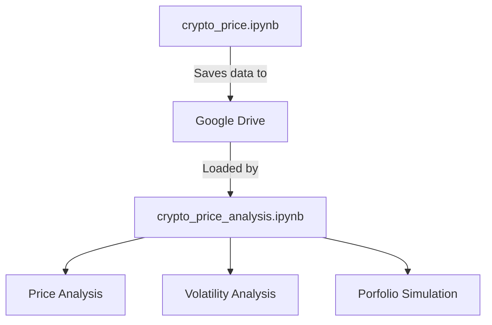

# Cryptocurrency Price Comparison Analysis
[](https://bitcoin.org/en/)
[](https://ethereum.org/en/)
[](https://ripple.com/xrp/)
[](https://cardano.org/)
[](https://www.shibatoken.com/)

[](https://finance.yahoo.com/markets/crypto/all/)
[](https://python.org)
[](LICENSE)

## Project Description
A comprehensive 5-year historical analysis tool for major cryptocurrencies, fetching complete OHLCV (Open-High-Low-Close-Volume) data directly from Yahoo Finance.

## Data Collection Methodology

This project systematically collects and processes cryptocurrency data using Yahoo Finance's API through the following workflow:

```python
# Configure cryptocurrency tickers and date range
crypto_tickers = {
    'BTC': 'BTC-USD',  # Bitcoin
    'ETH': 'ETH-USD',  # Ethereum
    'SHIB': 'SHIB-USD', # Shiba Inu
    'ADA': 'ADA-USD',  # Cardano
    'XRP': 'XRP-USD'   # Ripple
}

# Set 5-year historical window
end_date = datetime.now()
start_date = end_date - timedelta(days=5*365)

```
## Table of Contents
- [Features](#features)
- [Data Sources](#data-sources)
- [Installation & Setup]()
- [Analysis Findings]()

## Features

- Real-time price comparison between BTC, ETH, XRP, ADA, and SHIB
- Historical price analysis (5Y)
- Volatility metrics and correlation coefficients
- Relative performance comparison
- Trading volume and market cap analysis
- Yahoo Finance API integration

## Data Sources

This project exclusively uses **[Yahoo Finance](https://finance.yahoo.com/cryptocurrencies/)** for:
- Real-time price data
- Historical OHLC (Open-High-Low-Close) values
- Trading volume metrics
- Market capitalization data

```python
# Example Yahoo Finance API call
import yfinance as yf

btc = yf.Ticker("BTC-USD")
btc_history = btc.history(period="1y")
```
Here's an expanded **Installation & Setup** section that clearly documents your two-notebook workflow (Data Collection + Analysis) in Google Colab:

---

## Installation & Setup

This project uses a two-notebook workflow in **Google Colab**:

### 1. Data Collection Notebook (`crypto_price.ipynb`)
[](https://github.com/LexMainye/Crypto-Price-Analysis/blob/main/Crypto_Price_Data.ipynb)

**Purpose**: Fetches 5 years of historical OHLCV data from Yahoo Finance and saves it to Google Drive.

#### Setup Instructions:
```python
# Run these commands first in Colab
!pip install yfinance pandas --quiet
!mkdir -p /content/crypto_data

# Mount Google Drive (for saving datasets)
from google.colab import drive
drive.mount('/content/drive')

# Set your custom data path
data_path = "/content/drive/MyDrive/CryptoProject/data/"
```

#### Key Cells:
1. **Ticker Configuration**:
```python
crypto_tickers = {
    'BTC': 'BTC-USD',
    'ETH': 'ETH-USD', 
    'SHIB': 'SHIB-USD',
    'ADA': 'ADA-USD',
    'XRP': 'XRP-USD'
}
```

2. **Data Fetching Execution**:
```python
# Calculate date range for 5 years
end_date = datetime.now()
start_date = end_date - timedelta(days=5*365)

# Format dates as strings for yfinance
start_date_str = start_date.strftime('%Y-%m-%d')
end_date_str = end_date.strftime('%Y-%m-%d')

def get_crypto_data(tickers_dict, start_date, end_date):
    results = {}
    print("\nFetching 5-year historical cryptocurrency data from Yahoo Finance...")

    for crypto_name, ticker in tickers_dict.items():
        print(f"\nFetching data for {crypto_name} ({ticker})...")
        try:
            # Get complete OHLCV data
            data = yf.download(
                ticker,
                start=start_date,
                end=end_date,
                progress=False
            )

            if not data.empty:
                results[crypto_name] = data
                print(f"Successfully fetched {len(data)} days of data for {crypto_name}")
            else:
                print(f"No data returned for {crypto_name}")

        except Exception as e:
            print(f"Error fetching data for {crypto_name}: {str(e)}")

    return results

# Fetch all cryptocurrency data
historical_data = get_crypto_data(crypto_tickers, start_date_str, end_date_str)

# Save each cryptocurrency's data separately
print("\nSaving data for each cryptocurrency:")
for crypto_name, data in historical_data.items():
    if not data.empty:
        # Create filename (e.g. btc_5year_daily_data.csv)
        filename = f"{crypto_name.lower()}_5year_daily_data.csv"
        filepath = os.path.join(data_path, filename)

        # Save complete OHLCV data
        data.to_csv(filepath)
        print(f"Saved {crypto_name} data to {filename}")

        # Save monthly resampled data
        monthly_data = data.resample('M').last()
        monthly_filename = f"{crypto_name.lower()}_5year_monthly_data.csv"
        monthly_filepath = os.path.join(data_path, monthly_filename)
        monthly_data.to_csv(monthly_filepath)
        print(f"Saved {crypto_name} monthly data to {monthly_filename}")

# Save combined close prices
if historical_data:
    combined_close = pd.DataFrame()
    for crypto_name, data in historical_data.items():
        if not data.empty:
            combined_close[crypto_name] = data['Close']

    combined_filename = "all_cryptos_5year_close_prices.csv"
    combined_filepath = os.path.join(data_path, combined_filename)
    combined_close.to_csv(combined_filepath)
    print(f"\nSaved combined close prices to {combined_filename}")
```

3. **Data Saving** (to Google Drive):
```python
# Example save path in Drive
data_path = "/content/drive/MyDrive/CryptoProject/data/"
```

---

### 2. Analysis Notebook (`crypto_price_analysis.ipynb`)
[](https://github.com/LexMainye/Crypto-Price-Analysis/blob/main/Crypto_Price_Analysis.ipynb)

**Purpose**: Performs statistical analysis and visualizations on the collected data.

#### Setup Instructions:
```python
# Mount Google Drive (same as Notebook 1)
from google.colab import drive
drive.mount('/content/drive')

# Install analysis dependencies
!pip install matplotlib seaborn numpy --quiet

# Set path to collected data
data_path = "/content/drive/MyDrive/CryptoProject/data/"
```

#### Key Analysis Features:
1. **Data Loading**:
```python
def load_crypto_data(crypto_name):
    filepath = f"{data_path}{crypto_name.lower()}_5year_daily_data.csv"
    return pd.read_csv(filepath, parse_dates=['Date'], index_col='Date')
```

2. **Sample Analysis Cells**:
```python
# Comparative Returns Analysis
btc = load_crypto_data('BTC')
eth = load_crypto_data('ETH')

# Calculate annualized returns
btc_returns = btc['Close'].pct_change().mean() * 365
eth_returns = eth['Close'].pct_change().mean() * 365
```

3. **Visualization Examples**:
```python
import matplotlib.pyplot as plt

plt.figure(figsize=(12,6))
plt.plot(btc['Close'], label='Bitcoin')
plt.plot(eth['Close'], label='Ethereum')
plt.title('5-Year Price Comparison')
plt.legend()
plt.show()
```

---

### Workflow Diagram


### Recommended Colab Settings
1. **Runtime Type**: GPU/TPU not required (CPU is sufficient)
2. **Recommended Colab RAM**: 8GB+ (for handling 5 years of multi-asset data)
3. **Authentication**: Only needed for Google Drive access

### First-Time Setup Checklist
1. Run `crypto_price.ipynb` first to populate your Drive with data
2. Verify files exist in your Drive folder:
   - `btc_5year_daily_data.csv`
   - `eth_5year_daily_data.csv` 
   - ... (other assets)
   - `all_cryptos_5year_close_prices.csv`
3. Open `crypto_price_analysis.ipynb` and update the `data_path` if needed

---
# Analysis Findings
